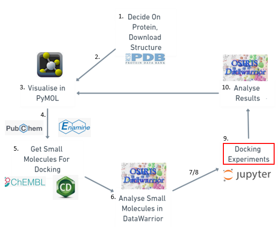
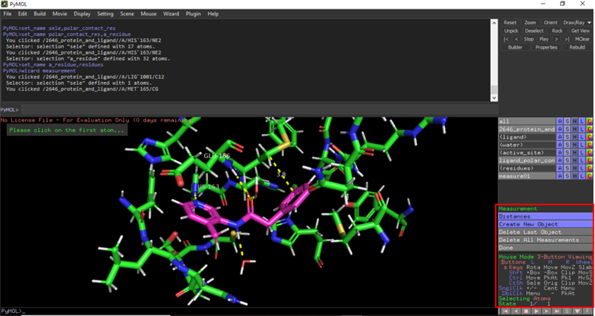
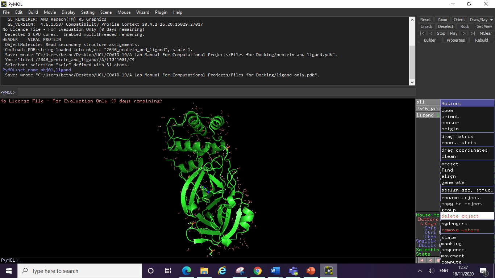
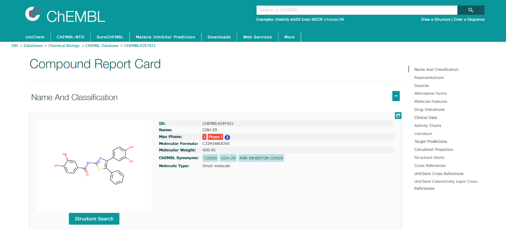
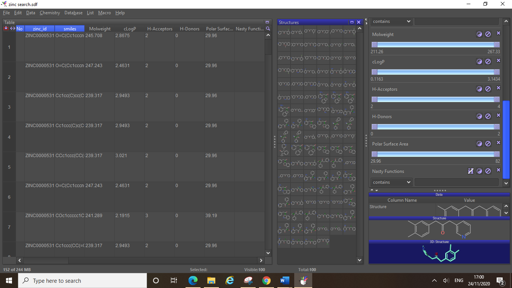
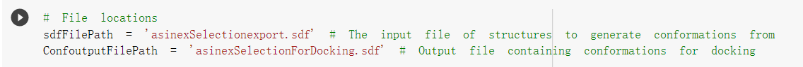

<markdown>

**Department of Chemistry**

**School of Pharmacy**

Computational Molecular Docking Projects Using Open-Source Tools

A Guide to the Course

Version 1 (2020/21)

**Contents**

**1. Workflow 2**

**2. Introduction 4**

**3. Getting pdb Files of your Target Protein 5**

> **3.1 The Protein Data Bank 5**

1.  **Other Sources 5**

**4. PyMOL 6**

1.  **How to install PyMOL 6**

2.  **Viewing your Target Protein 7**

3.  **Looking at the Active Site 12**

4.  **Ligand Interactions 16**

5.  **Preparing Files for Molecular Docking Experiments 23**

6.  **How to Use the PyMOL Command Line 27**

7.  **Command Line Tutorial 27**

**5. Searching Online Databases 36**

1.  **PubChem 36**

2.  **ChEMBL 39**

3.  **Zinc15 43**

4.  **Enamine 45**

**6. DataWarrior 48**

> **6.1 Installing DataWarrior 48**
>
> **6.2 Viewing your Dataset in DataWarrior 50**
>
> **6.3 Examining Properties and Useful Filters 52**
>
> **6.4 Saving your Refined Dataset as a Single sdf File 57**
>
> **6.5 Generating 3D Conformations of Compounds in 58 DataWarrior**

**7. Designing Compounds 61**

**7.1 ChemDraw3D Energy Minimisation of Compounds 61**

**8. Creating Single sdf files for docking 65**

> **8.1 Manipulating Text Files 65**

**9. Molecular Docking Experiments 70**

**9.1 Accessing the UCL Cluster and Setting Up a VPN 70**

**9.2 Uploading your Files 71**

**9.3 How to Run the Jupyter Notebook 72**

**9.4 Google CoLab 81**

**10. Analysing Results 84**

**10.1 Analysing Results in DataWarrior 84**

**10.2 Viewing Poses in PyMOL 86**

**10.3 Checking Text Files – Ordering Results 89**

**10.4 2D Interaction Diagram 90**

**11. Additional Useful Resources 94**

**12. Glossary of Terms 95**

**13. Acknowledgements 96**

**1. Workflow**

1.  **Identify a target protein (discuss with supervisor).**

2.  **Find pdb files for your target (either from the RCSB PDB or from another source):** make sure the experimental method (X-ray, NMR…) and the protein resolution are acceptable (normally less than 2.5Å); don’t forget to check the organism & expression system (e.g. *E. Coli*). **You will need a pdb file of your target protein with a ligand bound.**

3.  **Examine the protein of interest in PyMOL:** students will explore the different ways to view their protein’s structure and learn how to use PyMOL to view various pdb files with and without ligands bound. Students will be able to investigate binding interactions between the protein and bound ligands. Students will be able to come up with potential improvements and ideas for docking experiments.

4.  **Use online databases to find compound datasets for docking experiments:** searching online libraries such as PubChem, ChEMBL, Zinc15 and Enamine students can build compound datasets to use in molecular docking experiments.

5.  **Design novel compounds in ChemDraw:** students will design their own compounds in ChemDraw based on PyMOL analysis. These designs will be saved as sdf files and viewed in DataWarrior.

6.  **Data processing in DataWarrior:** students will examine the properties of the compounds found from the online databases and the designed compounds. Checking for key properties (LogP, MW, TPSA) and filtering out any undesirable compounds (such as those containing nasty functions, or particularly strained conformations).

7.  **Energy minimisation of structures to be docked:** 3D conformations of the structures to be used in docking experiments will be produced, these 3D conformations will be the minimised energy conformation of the compounds (required for docking). Lists of compounds to be docked will be saved as sdf files based on their 3D atom coordinates. sdf files for docking will be formed by manipulating text files to compile all designs/compounds for docking into a single sdf.

8.  **Optimising the pdb files for docking - advanced processing techniques:** to optimise the pdb files to be fit for docking experiments, extra computational tools are required. Protonation (opensource: H++/Propka), addition of missing loops or residues (opensource: Modeller) of a crystal structure (Dr Chris Swain can help with these using MOE) 

9.  **Molecular docking:** students will design and perform their own molecular docking experiments by using a Jupyter notebook. Jobs will be performed on the UCL cluster via a VPN or on the students own machines if all required programmes are installed. (Command line techniques required.)  

10. **Analysing the results:** students will analyse the results from their docking experiments in DataWarrior and in PyMOL.

11. **Investigate the synthetic routes and feasibility of lead compounds:** students can research the commercial availability and synthesis procedures involved in making their most promising compounds. Viable compounds could be suggested for synthesis at collaborating laboratories or made by the student themselves in the synthetic stage of their research projects.  

**2. Introduction**

Molecular docking is a computational technique which models the binding interactions between any given ligand and protein. With certain algorithms applied, the resulting array of binding possibilities are ranked in the order of predicted binding affinities. Therefore, whether a molecule can bind to a protein can be estimated with the help of computational power. Such a method is especially useful in structure-based drug design. There are a variety of freely available open-source tools which can enable scientists around the world to have access to these computational techniques and test potential drug molecules via *in silico* experiments.

This guide is intended to walk you through the processes involved in your molecular docking projects, from target analysis and compound selection to docking experiments and analysis. The manual is a beginner’s guide and requires no prior knowledge of computational techniques, with methods pitched at the Masters or final year undergraduate level.

**In this manual, you will learn how to:**

1\. Use online databases and computational tools to assist drug discovery

2\. Use molecular docking techniques via the UCL cluster to perform *in silico* tests on your compounds

**  
**

**3. Getting pdb Files of your Target Protein**

**3.1 The Protein Data Bank**

The Protein Data Bank (PDB) was established as the 1^st^ open access digital data resource in all of biology and medicine. It is today a leading global resource for experimental data central to scientific discovery. Through an internet information portal and downloadable data archive, the PDB provides access to 3D structure data for large biological molecules (proteins, DNA, and RNA).

<https://www.rcsb.org/>

You can find a crystal structure of your target protein on the PDB website by performing a simple text search. For example, “COVID-19 main protease”, you will find numerous entries via this search function and all records will include information about the source of the crystal structure.

Important features to note are the PDB code (4-digit code, e.g. 6YB7 above), the organism and expression system, details about the authors, and the resolution of the crystal structure. You can download a crystal structure pdb file directly from the website by clicking the “download files” button and selecting pdb format.

**3.2 Other Sources**

There are other ways to obtain pdb files of your target protein, such as from your supervisor (if they have generated a crystal structure themselves in pdb format) or from the Diamond Light Source website (for COVID-19 projects). The Diamond website has a downloads section under their “for scientists” tab. Here you can download all the crystal structures from their fragment screen, and their high-resolution structure of the main protease (PDB: 6YB7).

<https://www.diamond.ac.uk/covid-19.html>

**4. PyMOL**

**4.1 How to Install PyMOL**

PyMOL is an open-source biomolecule viewer which can be used to view proteins and their ligands. PyMOL can be downloaded from the following link, which will take you to the PyMOL by Schrödinger website: <https://pymol.org/2/>

PyMOL has two versions available: the incentive version and the open-source version. As a student, we have access to both of them: we can apply for an academic licence to use the incentive version (but only for educational purposes) or we could use the open-source version of PyMOL directly (free, can be used for publication). The link for academic licence registration is here: <https://pymol.org/edu/?q=educational/>

Download PyMOL by clicking on the “download now” button, and then selecting the correct version for your operating system.

You can also download PyMOL from the following sources:

[https://anaconda.org/psi4/pymol](https://eur01.safelinks.protection.outlook.com/?url=https%3A%2F%2Fanaconda.org%2Fpsi4%2Fpymol&data=04%7C01%7C%7C324044dce4da48b8bd5508d88bc5d994%7C1faf88fea9984c5b93c9210a11d9a5c2%7C0%7C0%7C637413029159142040%7CUnknown%7CTWFpbGZsb3d8eyJWIjoiMC4wLjAwMDAiLCJQIjoiV2luMzIiLCJBTiI6Ik1haWwiLCJXVCI6Mn0%3D%7C1000&sdata=T2Ass%2Bjp7t8twqrPNVhUvfdy%2FhBIjYQimP2IdnNuF1E%3D&reserved=0)

[https://omicx.cc/2019/05/26/install-pymol-windows/](https://eur01.safelinks.protection.outlook.com/?url=https%3A%2F%2Fomicx.cc%2F2019%2F05%2F26%2Finstall-pymol-windows%2F&data=04%7C01%7C%7C324044dce4da48b8bd5508d88bc5d994%7C1faf88fea9984c5b93c9210a11d9a5c2%7C0%7C0%7C637413029159151997%7CUnknown%7CTWFpbGZsb3d8eyJWIjoiMC4wLjAwMDAiLCJQIjoiV2luMzIiLCJBTiI6Ik1haWwiLCJXVCI6Mn0%3D%7C1000&sdata=FXjXzaz%2B2t%2F79JpmMhc%2FB193iP1tG2UbeLP%2FyJ4ATCw%3D&reserved=0) 

or PyMOL source code from GitHub: <https://github.com/schrodinger/pymol-open-source>

After you have installed PyMOL open the programme and you should find something looking like this:

An activation window will also pop up, requesting you to browse licences, you can ignore this and close the window. PyMOL will display the red “no license file” warning and give you a trial period of 30 days. However, do not worry, after this period expires you will still be able to use PyMOL, the message will simply start reading “0 days remaining” as you can see above.

**4.2 Viewing your Target Protein**

Once you have a target selected you will need to find a pdb file of it from either the Protein Data Bank website (PDB, <https://www.rcsb.org/>) or from your own source. Once you have this pdb file you can open it in PyMOL either from your computer as you would open any other file, or you can use PyMOL’s “fetch” function which can be used to open files directly from the PDB. Type in the command as shown below and then press enter. The command line is case sensitive so be sure to type the command correctly. Here the 6YB7 is the code name of the pdb file for the SARS-CoV-2 Main Protease, which will be used in this example. For your own protein simply replace this code with your proteins code name from the PDB. 

Now you have your protein displayed in the PyMOL viewer you can interact with it and visualise it in different ways using PyMOL’s tools. You will see PyMOL has the file displayed in the side menu, clicking on the entry will make the protein disappear from view, if you have multiple files open then you can choose which files are displayed at the same time in this way. Next to the files name you can see 5 buttons which will allow you to manipulate the protein to alter the way it is shown, clicking these buttons take you to their individual menus, A = action, S = show, H = hide, L = label and C = colour.

The first thing you can try is to remove the rather ugly looking red crosses, these are the water molecules from the crystal structure and are currently being displayed as these red crosses (really these crosses are just the oxygen atoms since you cannot usually detect hydrogen atoms in crystal structures without further optimisation, see later). Click on the action menu and then click remove waters.

Alternatively, you can type the command “hide nonbonded” and then press enter. This will also remove the nonbonded water molecules from view.

Next you may want to remove all of the solvent molecules still in view, X-ray structures often contain co-solvents or other molecules to aid crystallisation. To remove these, you can select them in the display window by clicking on them all individually (they will become highlighted when you do so). You will see your selection will now show in the side menu as a (sele) entry. You can rename this selection if you wish to keep it as an entry, by clicking on the action button, and then clicking rename. Type in the new name of your selection and press enter.

You can then hide these solvent molecules by clicking on the hide button, and then clicking everything (make sure you do this on your new selection entry on the side menu and not on your whole protein entry).

Those of you who are familiar with protein structure will be able to recognise the various secondary structure elements of your protein. In this example we can see some α-helices and some β-barrel structures. PyMOL allows you to select individual amino acid residues and colour them however you like, however a quick and easy way to show the individual domains of a protein is to use the chainbows colour option. To do this, click on the colour button, then click by chain, then click chainbows. You should see something looking like the image below.

Now we can see secondary structure elements more clearly, with the three domains of this protein showing as blue, green and orange/yellow sections of the structure. You can colour your whole protein in any shade you like by using the colour menu, you can also colour specific parts of the structure by selecting them (as shown earlier for the solvent molecules) and renaming them. Simply click on the colour menu and select the colour you want. Colouring by element is a good way to easily identify individual atoms if you have any residues shown (see later), as this option will keep the oxygens red and the nitrogens blue regardless of what colour you choose your carbon sticks to be.

Currently your protein is displayed as a cartoon structure (however different files may open in different forms). To change the way your protein is displayed, click on the show button, then click whichever way you wish to display the protein, for example clicking sticks will give you this view:

Notice that the cartoon structure did not disappear when you did this, the sticks simply show as well as the cartoon. If you want to undo or hide something, click on the hide button and select the thing you wish to hide, for example to return the protein to only show its cartoon structure you can click on hide, and then sticks.

You should play around with the different ways to view your protein, including looking at the surface view of the protein (show surface) as this will show you clearly where the ligand pockets are including the active site. In this example the active site pocket is located between the two β-barrel domains, and can be easily found by noticing the yellow sulphur belonging to this proteins nucleophilic cysteine residue (cysteine protease). For the image below we have rotated the protein to give the best view (simply click and drag on the display area to move the protein and rotate the view). We have then clicked show, and then clicked surface. Note that the sulphur atom was only distinguishable in this way because we had previously coloured the protein by element.

**4.3 Looking at the Active Site**

The easiest way to select specific residues is to look at the sequence of your protein and select the amino acids you want by their one letter code. If you know which amino acids make up the active site, you can select them in this way to make an active site selection. Click display, then click sequence. You will see a new line appear at the top of the display window (it will be in the same colour as your protein).

From here you can now select individual residues (by clicking on their letter in the sequence) and create new selections. Rename your selection in the same way as before and choose a colour for these residues to make them stand out from the rest of the protein. (Note – crystal structures don’t always contain the entire sequence so you may find that your first residue is not numbered 1.)

Here we have selected some of the active site residues of this protein, G143, S144, C145, H163 and E166 and shown them as sticks (click the show button, then click sticks), colouring them yellow and by element. You can make your new selection the centre of your protein by selecting the action button, then clicking centre. You can also label these residues by clicking on the label button, and then clicking residues (to display the three letter code, or click residues (one letter) to display the one letter code labels).

This is an easy way to build up a colour coded picture of your active site, by selecting all the active site residues, and then colour coding them based on their function (for example, cyan for oxyanion hole, or orange for hydrophobic pocket etc.) you can build a ready-made active site pdb file. Having this pre-made file available can help you to easily view your docking results in your target protein, and colour coding it allows you to easily orientate yourself when viewing many different ligands.

Above is an example of a colour coded active site file with some docking results shown. Here the protein was coloured white (not by element, to create an entirely white surface), then the individual residues of the active site were selected and colour coded (again not by element, to give solid colours). You can see the colour coding also shows up on the sequence, which can help you easily find the residues you are looking for once you’ve colour coded them.

Below is another example of a pre-made file with docking results also opened. Here the residues were colour coded by element (as this is the best way when viewing their stick form) and they were labelled with the three-letter code. The docking results were also coloured to distinguish easily between the active site residues and the docked ligands. Note here that only the active site residues of the protein are shown, the rest of the proteins structure is hidden.

In addition to colouring specific active site residues, you can use the sequence to easily select certain elements of the proteins structure. For example, to colour one helix differently to the others, you can select the point on the cartoon structure where the helix begins, and the point where it ends, and then scroll along the sequence to find which residues you highlighted. You can then select all the residues between these two and easily highlight the whole helix. After renaming the selection and choosing a colour you will have something looking like this:

If you wanted to centre and zoom in on this secondary structure element and view the residues you can click on the show button of the helix selection, and then click sticks. The carbon backbone and side chains of all the residues making up the helix will now be visible.

You could hide the rest of the protein in a similar way by selecting the rest of the sequence, naming the selection, and then clicking hide everything, to leave just this helix showing in the display window. Alternatively, you could hide the entire protein by clicking hide, then everything on the protein entry (6YB7 on the side menu), and then show the helix again by clicking show, then cartoon (on the helix entry), and then again click show, and then sticks.

**4.4 Ligand Interactions**

You might have a pdb file which has a ligand bound to your protein of interest, or you may have some docking results which you wish to analyse. In PyMOL you can measure the distances between certain points on your ligand and specific active site atoms. These distances can determine whether or not binding interactions are possible between the ligand and the protein. You can also examine interactions between ligands and active site water molecules, and you can choose to display these water molecules as sticks, or spheres depending on your preference.

In this example we have a non-covalently binding ligand bound in the active site of the SARS-CoV-2 main protease. The first thing you will want to do is centre your display around your ligand. To do this select the ligand, rename the selection, click action, centre, and then you may wish to zoom in too. Next you will want to declutter the display, by hiding all waters which are not in the immediate vicinity of the ligand, and removing any solvent molecules from view. You can do this as shown above, or alternatively you can do this by using the sequence. At the end of your peptide sequence you will see LIG (this is the ligand), followed by some solvent molecules (DMS in this example), then you will see a series of 0s which denote the water molecules. Select the solvent and the water molecules from the sequence and unselect any important waters (those close to your ligand) by clicking on them again in the display window. Then click hide everything for your selection and you should be left with only the protein, the ligand and any waters you wished to keep.

Next you will want to colour the ligand separately to your protein, create a new selection and rename this “ligand”, then select the colour you want (by element). You can now start to select and show your active site residues as before. If you do not know which residues are in the active site, or how many of them to display, you can try this code. Type “show sticks, byres all within 5 of ligand” here the “ligand” was the name we gave to our selected ligand, if you have called it something else you should replace the word ligand with your selection name. This code will show the sticks of all residues within 5Å of your ligand, “byres” tells PyMOL to display the sticks of the whole residue. If you remove “byres” from this command then PyMOL will only show the sticks of atoms within 5Å (i.e. if a His side chain is within this distance but the main chain is not, then only the side chain will be displayed and not the whole His residue – you should try this out to spot the difference).

Next you can select all of the residues which have been displayed, colour them or label them if you wish, and be sure to name the selection (for example “active site”). Hiding the cartoon structure (click hide, cartoon) will allow you to focus on just the ligand and the active site residues. If your image isn’t showing all of the residues clearly unless you zoom out, you can try centring the display around your active site selection instead (click action, centre). You will notice any waters that were close to your ligand that you may have missed before have now reappeared.

  
PyMOL can measure some things straight from the action menu, for example polar contacts within a certain distance will be picked up by this method. To do this click on the ligand selection, click action, find, polar contacts, any atoms. This will show all polar contacts (within PyMOL’s designated distance) between your ligand any nearby residues/waters.

 

Here PyMOL has found four polar contacts (hydrogen bonds), two to nearby waters and two to active site residues. If we wanted to check which residues these were, we can select them (click on the atom from the display window and it will select the whole residue), rename, then click label, residue. We can see now that these residues were His163 and Glu166 (see below).

The pdb file being used here to demonstrate ligand interactions has been optimised (needed for detailed and accurate analysis, see later). As a result of this the water molecules are showing up as stick structures rather than the red crosses we saw earlier. Because of this optimisation the orientation of the water molecules is clear (and correct) in this file. If we did not have an optimised file at this point you could display the water molecule as a sphere instead (preferable to the red crosses). To do this select the water, click show, and then click spheres. An important difference between an optimised file and an unoptimised one is that the hydrogens show up correctly in the optimised structure, this is clear in the screenshot above where all residues have their hydrogens shown (optimisation takes local pka environment into account), the ligand and water molecules in this file also have their hydrogens displayed. Optimised files are required for docking experiments and accurate analysis in PyMOL, however you can do some preliminary analysis with unoptimised files (such as with the helix above), as long as you remember that the hydrogens are not yet present and so distances will vary if you have measured them yourself. One time you may look at unoptimised files in this way is if you had multiple different crystal structures of your target protein with different ligands or fragments bound. It might not be practical to optimise all of these files at first, so you could analyse each structure in PyMOL initially and decide which structure you wish to base your docking experiments on. Once you have selected which ligand you wish to use for initial compound design inspiration and/or online database searching you can choose this crystal structure and have this pdb file optimised. You would then re-examine the optimised file to get accurate measurements.

To measure all the possible interactions, including hydrophobic contacts and other distances you can use PyMOL’s wizard tool. Click wizard, then click measurement and you will now have a wizard section appear on your side menu.

Click on the atoms that you wish to measure between, PyMOL will create a new measurement entry on the side menu (measure01 here), you can rename and colour this measurement entry just like any other selection. Here we have measured one of the hydrophobic contacts of the ligand with Met165 (one of the residues making up the hydrophobic pocket of this active site). You will see that the distance of this measurement is displayed (3.8Å) unlike with PyMOL’s automatic polar contact measurements from earlier.

As well as using the wizard tool to measure interactions between your ligand and the active site, you can use it to measure distances between positions on your ligand and nearby chains. This can allow you to investigate the merits of adding substituents to a given position on your ligand, to see if the addition could add another hydrogen bonding interaction or to see if adding a substituent there would likely cause steric clash with nearby residues. You can then test your hypotheses in molecular docking experiments by designing compounds which have new substituents at these positions and then docking them to see if they do indeed fit (or not fit) in the same position as your original ligand.

**Common Problem:** *Mouse selecting single atoms instead of whole residues?*

You might have worked through the tutorial above and had no issues, or you may have suddenly found that by inadvertently pressing something on your keyboard you have now made it so that PyMOL selects individual atoms when you click on them rather than the whole residue (or ligand).

This is easily remedied:

Bottom right-hand corner you can see “mouse mode” here it correctly says 3-button viewing if yours doesn’t say this, see screenshot above to change the setting back to normal.

Also, you can see the “selecting” bit in the bottom right says residues, this is what you want. If yours doesn’t say this, to fix it see the screenshot below.

**4.5 Preparing Files for Molecular Docking Experiments**

In order to perform docking experiments in Jupyter, you will need 3 separate pdb files:

-   A pdb file of your target protein AND a bound ligand

-   A pdb file of your target protein ONLY

-   A pdb file of the ligand ONLY

You will already have a pdb file of your target protein and a bound ligand from your previous analysis in PyMOL, in order to create the other files, you will need to extract the ligand from the binding site. It is important that you only use optimised pdb files for your docking experiments, as unoptimised files can include multiple issues and inaccuracies.

The difference between an unoptimised and optimised version of the same pdb file can be seen above. Other issues you may have noticed when looking at an unoptimised file are residues appearing twice, in slightly different conformations, and loop breaks. Residues appearing multiple times in the same structure is due to these residues having fractional occupancies within the crystal structure, proteins are not static, and this is an artifact of the side chains ability to occupy different conformations within the protein. Loop breaks occur when there are gaps in the sequence, leading to certain residues being missing from the structure. As mentioned earlier another obvious difference is the missing hydrogen atoms in the unoptimised structure. **In order to optimise your files,** there are some open-source programmes you can try out such as H++/Propka (for adding the hydrogens) and Modeller (for loop breaks and missing residues). Alternatively, Dr Chris Swain can help by using his pipeline for these issues in MOE to optimise a file for you.

Pdb file formats do not contain bond orders so these are inferred from the interatomic distances, you will want to check these are correct (in your ligand and in any important residues). Similarly, when analysing a crystal structure, it is important to check the tautomers of the imidazole rings in histidine side chains and check the positioning of atoms in certain residues such as asparagine and glutamine (as it can be difficult to differentiate between the N and O of these side chains). **Essentially optimisation is just something that needs to be done to a pdb file if you wish to use it for docking experiments (and for full analysis of ligand interactions).** It is technically possible to display the hydrogens in an unoptimised file, however for all the reasons stated above this is not advisable. The hydrogens may not be in the right place and any water molecules will not be orientated correctly in an unoptimised file.

Once you have your optimised pdb file containing your target protein and a ligand, load up the pdb file and rename the PyMOL entry on the side menu as “protein and ligand”. To save this entry as a pdb file click file, then export molecule…

Make sure the selection is the correct entry that you want to save (use the dropdown menu), and then click save. When naming your file you may wish to be more specific about which ligand is docked in this structure (for example if you are going to dock a series of compounds against multiple different reference ligands then you should be clear which pdb file contains which ligand – for example here this ligand was named 2646).

Ensure you have saved the file as a .pdb file and put it somewhere convenient for docking. It is a good idea to have all of your docking filles saved in the same folder, so that you can easily access them when uploading them to Jupyter for docking (see later).

Next you will need to make a pdb file of just your ligand, to do this select the ligand click on the action menu, then click extract to object.

You will now see PyMOL has created a new object entry, you can rename this “ligand” (PyMOL will replace the previous selection name with this object). Clicking on the ligand entry will cause the ligand to disappear from view separately to the protein now it has now been extracted from the rest of the structure. Save this ligand as a separate pdb file in the same way you saved your protein and ligand file, click file, export molecule…, then select the ligand entry from the drop-down menu. Save your “ligand only” pdb file in the same docking folder as before.

Finally, to make your protein only file you can delete the ligand object entry from the side menu, to do this click on the action menu, and then select delete object. You can now save the remaining entry as your protein only pdb file (file, export molecule…).

You should check all of your pdb files before using them for docking to make sure everything is correct (ligand file only contains the ligand etc.). For example the new protein only file is shown opened below:

 **  
**

**4.6 How to Use the PyMOL Command Line**

By now you will already be familiar with the basic logic of PyMOL and should be confident with performing a lot of manipulations to your proteins structure. PyMOL has a lot of functionality which can be easily accessed from the graphical user interface (i.e. clicking and selecting things using the side menu). Whilst this way of using PyMOL is visually intuitive and quick to learn, it can sometimes be time consuming doing everything manually step-by-step. The command line offers a faster way of performing many actions in PyMOL and offers users a way to create custom scripts which quickly transform the way a protein is visualised.

The crystal structure selected for this tutorial is 3uag (MurD ligase from *E. Coli* crystallised with two substrates called UMA and ADP). As the UMA binding site can be viewed as a potential target site, this tutorial is going to teach you how to use command line to visualise the interactions at the UMA active site and produce a publication-quality image of it in PyMOL.

**Useful links:**

The PyMOL command reference library:

<https://pymol.org/pymol-command-ref.html>

The PyMOL script library:

<https://pymolwiki.org/index.php/Category:Script_Library>

**4.7 Command Line Tutorial**

**1. Obtain your protein structure:**

fetch 3uag

**General format:** fetch + “pdb code”

**2. Remove a chain you are not going to work on (if applicable):**

A protein’s chains are already defined in its pdb file, the chains will have a name denoted to them such as “chain A” or “chain B”. In the case of 3uag, the MurD protein only has one chain (chain A) in its crystal structure, so there is no need to delete or select chains. Thus, here we need to take another protein structure as an example: 1p3d (MurC ligase from *H. influenzae* crystalised with UMA, ANP) which has two chains (A&B) and is shown in cyan in the picture below.

**Type in the following commands**

fetch 1p3d *obtain 1p3d pdb structure*

remove chain B *obtain 1p3d pdb structure* *delete the chain B from 1p3d structure*

**3. Hide water molecules for a better view of interactions (for unoptimised proteins):**

Back to 3uag as you can see below, water molecules were shown as red crosses in the left-hand side figure and disappeared in the right-hand side figure after the commands were applied.

hide nonbonded *hide water molecules from view; can also hide cartoons, ribbons, lines, etc*

**General format:** hide “object”

**4. Select the ligand and give it a system-recognised name:**

In this case, UMA is the ligand that needs to be selected and named. The PyMOL system recognises the UMA ligand as “resi 450”. So we need to select UMA first by its residue name (a temporary name ”sele” will be given to the selection and it will appear on your right-hand side in the side menu) and then change its name to be “UMA” (“UMA” will appear in the side menu and will stay there forever unless you delete it).

**1) 1-step strategy:**

sele UMA, resi 450 *“sele” is the abbreviation of “select”*

> *“resi” means residue identifier, can be abbreviated as “i.”*

**General format:** sele “new_name”, “object”

**2) 2-step strategy:**

sele resi 450 *a temporary name “sele” is assigned to the selection (residue 450)*

set_name sele, UMA *rename the selection*

**General format:** sele “object”; set_name “old_name”, “new_name”

**5. Select and name the active site residues around the target substrate**

As we have defined UMA with a name recognised by the PyMOL system, we can now move on to further explore the surrounding residues and define them as the active site residues. In the case of 3uag, We have chosen residues within a 5Å distance of UMA as the active site residues. If you only want to find strong interactions, such as H-bonding, a range between 1.5-3Å is suitable. However, you should choose a larger range (i.e. up to 5Å) to explore weaker interactions such as hydrophobic contacts.

**Define all residues within distance of 5Å towards UMA as “UMA_activesite”:**

sele UMA_activesite, br. all near_to 5 of UMA

**General format:** sele “new_name”, br. all near_to “distance” of “object”

*“sele UMA_activesite” defines the name of the selection as “UMA_activesite”.*

*“br.” is the abbreviation of “byres”, “byres selection” means expand selection to complete residues.*

*“near_to” has the same functionality as “around”, meaning select things around the centre within a distance while the centre is not included. (Sometimes one of them may not work because of bugs, need to restart PyMOL or go with the leftover one).*

*“5” means “5 Å”; “UMA” has been defined in Step 4.*

**Specifically, if you want to visualise all of the UMA active site water molecules, type in the following syntaxes:**

sele UMA_activewater, ( (UMA_activesite and chain A) around 3) and (resn HOH)

show licorice, UMA_activewater

**General format:** sele “new_name”, ( (“object” and “chain_x”) around “distance”) and (“residue name”); show licorice, “object”

*“UMA_activewater” is the new name given to the selection (you can change it to whatever you like).*

*“UMA_activesite” has already been defined in the previous step, so you can use it directly here.*

*“chain A” represents the chain you are working on (can be replaced by chain B, C, D…any chain you like).*

*“around 3” means that your selections will be limited to the distance of 3 Å towards the centre object.*

*“resn” represents “residue name”; “resn HOH” means water molecules. “*

*“licorice” is a way of representation. “sticks” and “lines” are used frequently as well.*

*“UMA_activewater” has been defined already.*

**6. Colour anything you want:**

Here we have two ways of colouring the UMA ligand and the surrounding residues.

**1) basic colouring (fig a):**

colour yellow, UMA

**General format:** colour “object”

**2) colour by atom types (fig b & c):**

util.cbay UMA

util.cbac UMA_activesite

**General format:** util.cba\* “object”

*“util” means utility control.*

*“cba**\***” means colouring by atom, and the default settings for atoms are as followings: oxygen (red), nitrogen (blue), hydrogen (white), manganese (purple)… Carbon atoms will have different colours depending on the commands (shown in **Table 1**)*

| Table 1: A collection of “util.cba\*” commands |               |               |               |               |
|------------------------------------------------|---------------|---------------|---------------|---------------|
| util.cbag                                      | util.cba**c** | util.cba**m** | util.cba**y** | util.cba**s** |
| Green                                          | cyan          | light magenta | yellow        | salmon        |
| util.cbaw                                      | util.cba**b** | util.cba**o** | util.cba**p** | util.cba**k** |
| white/grey                                     | slate         | bright orange | purple        | pink          |

**7. Visualise active site residues in detail:**

**1) show line structures of active site residues (fig d):**

show lines, UMA_activesite *UMA_activesite will be shown in lines, “lines” is a way of representation*

**General format:** show lines, “object”

**2) show stick structures of active site residues (fig e):**

show sticks, UMA_activesite *UMA_activesite will be shown in sticks, “sticks” is another way of representation*

**General format:** show sticks, “object”

**8. Only show the active site:**

As you might have found already, the ribbons/cartoons of the protein backbone can sometimes make it difficult to see the interactions at the binding site. Therefore, the following commands should help you to focus only on the active-site residues and the ligand. In the case of 3uag, UMA, UMA_activesite, UMA_activewater have been defined in the previous steps. The only thing left is the manganese cation, so we need to define it and make it visible. Here Mn^2+^ is recognised as “resi 1000” which can be found when viewing the sequence.

hide

show licorice, UMA

show licorice, UMA_activesite

show licorice, UMA_activewater

sele resi 1000

set_name sele, MN

show sphere, MN

*“sphere” is a way of representation. “hide” is equivalent to “hide all”.*

**9. Get a general view of where the substrate is bound and where you should target:**

show surface

**You can also hide the surface if you want:**

hide surface

**For specific illustration of the active site:**

The following sequence of code is an example of a script, which can be copied and pasted into the PyMOL command line. When scripts are entered into the command line PyMOL will execute each command individually (performing the entire sequence of commands) thus eliminating the need for you to type in each command separately.

show surface

colour white, all

util.cbay UMA

util.cbac UMA_activesite

show licorice, UMA

show licorice, UMA_activesite

show licorice, UMA_activewater

You can make many scripts such as the one above to quickly transform your pdb file into displaying the protein in a specific fashion. You can create scripts in a script compiler (e.g. text editor) and from there you can directly copy and paste the entire script into your PyMOL command line. This can help when making pre-made pdb files to view your docking results in (see section 4.3) and can drastically cut down the time to do a series of complex manipulations. Note – you will not be able to directly copy and paste a script from a pdf or word document into the command line (it will not work), but you can copy and paste the commands individually in this way.

**10. Focus on the substrate in the active site:**

zoom UMA

**General format:** zoom “object”

**11. Illustrate interactions at the active site:**

In the case of 3uag, only the polar interactions within 3Å were illustrated. But there are more options of visualising different types interactions as explained above.

dist interactions, UMA, UMA_activesite, 3, mode=2

hide labels

**General format:** dis “new_name”, “object1”, “object2”, “distance \_cutoff”, mode=2

\[note here: if “hide labels” was not applied, this function can be used for distance measurement between object1 and object2 and the distance will be visualised on labels\]

*“dist” creates a distance link between two selections.*

*“mode=2” means only show polar contact distances. There are several other modes (shown in **table 2**)*

<table><thead><tr class="header"><th>Table 2: A collection of “mode” commands</th><th></th><th></th><th></th><th></th></tr></thead><tbody><tr class="odd"><td>mode=0</td><td>mode=1</td><td>mode=2</td><td>mode=3</td><td>mode=4</td></tr><tr class="even"><td>all interatomic distances</td><td>only bond distances</td><td>only show polar contact distances</td><td>like mode=0, but use distance_exclusion setting</td><td>distance between centroids</td></tr><tr class="odd"><td>mode=5</td><td>mode=6</td><td>mode=7</td><td>mode=8</td><td></td></tr><tr class="even"><td>pi-pi and pi-cation interactions</td><td>pi-pi interactions</td><td>pi-cation interactions</td><td>
like mode=3, but cutoff is the ratio between

distance and sum of VDW radii
</td><td></td></tr></tbody></table>

**12. Add hydrogens to your ligand, water molecules and active site residues**

You can select the residues, water molecules, or atoms of the ligand (which will give them a temporary name called “sele”) that participate in the visualised interactions in step 11 and then add hydrogen atoms to the structure to visualise interactions in detail. (Not necessary to do this in the unoptimised structures.)

h_add sele *add hydrogen atoms to anything you select, in this case it is an atom*

h_add UMA_activewater

**General format:** h_add “object”

**13. Labelling your preferred residues:**

In order to label a residue, you need to select one of its atoms (we would suggest selecting the central atom of that residue) and then type in the following commands to generate a label with the proper size and colour.

label sele, "%s:%s %s" % (resi, resn, name)

set label_size, 20

set label_color, white, sele

**General format:** label “selection”, "%s:%s %s" % (resi, resn, name); set label_size, “size_number”; set label_color, “colour_name”, sele

\[note here: label_color must be American spelling otherwise it will not work\]

**14. Background settings:**

bg_colour white

transparency = 0.5

**General format:** bg_color “colour_name”;

transparency = “number”

**15. Generating an image:**

png 3uag.png, height=1920, width=1920, dpi=300, ray=1

**General format:** png “new_name”, height=”height”, width=”width”, dpi=”pixel”, ray=1

*"ray" creates a ray-traced image of the current frame, could be time-consuming Here “ray = 1” this means ray should be run first (the default is “ray = 0”).*

*“png” set the generated image format to png.*

**  
**

**5. Searching Online Databases**

**5.1 PubChem**

[**PubChem**](https://pubchem.ncbi.nlm.nih.gov/) is one of the most straightforward databases to use and it is very popular among college students as its framework is very user-friendly. For this project, the “Draw Search Section” will be used for most of the situations. Occasionally, “Upload ID list” may help once you have got a huge list of known structures to check.

**1.** To quickly examine your compounds (chem/phys-property, novelty, literature related etc.), the “Draw Structure” section can be useful as it is just like the functionality of what you have learned from SciFinder, Reaxys, or whatever other databases.

You can either type in the SMILES format of your compound or draw the whole structure out within this interface. There are several other options to input your compounds (shown below).

**2.** After clicking on the “Search for This Structure” button, you will see the following interface (shown below) with multiple functionalities available to optimise your searching results. The searching bar on the top shows the SMILES format of your compound (useful if you have no idea of the SMILES form of your compounds). Also, the “Sort By” utility allows you to specify your needs while searching (multiple properties of compounds are listed).

**3.** There is a “summary” button down below the first result, as you can see, which can link you to another page with a full list of information about the compound (investigate them on your righthand side).

**4.** Back to step 2, click on the “Similarity Structures Search” button and you will get a collection of structures which have different degrees of similarity towards the original one. Several options to further segregate those results have been provided on the top bar: Identity, Similarity, Substructure, Superstructure, and 3D Similarity.

**5.2 ChEMBL**

[**ChEMBL**](https://www.ebi.ac.uk/chembl/) is an open database of considerable amount of bioactivity data which comes from scientific literature, public databases, patents, etc. It is essentially useful for the drug discovery process.

**1.** You can find all the information classified in different forms.

**2.** For the search of targets, you can simply type in your target name and select it.

**3.** You can check information about the number of compounds which have been tested against the target in the “Compounds” section. Also, you can check the “Activities” section for IC~50~, K~d~, K~i~, etc.

**4.** By clicking on the ChEMBL ID, you will be able to see the “Target Report Card” page which contains all the available information about your selected target.

**5.** For the search of compounds, you can type in your compound’s name in the search bar such as MurD inhibitor.

Then you will get the compounds page where you can select the ones you want to check by simply tick the little square on the top right of each compound box (marked area 1). Or you can select all compounds in marked area 2.

.

**6.** To check the details of your preferred compounds, there are several options for you (marked area 2). Take “Browse Activities” as an example, compound structures, activities, assay, target and sources will all be shown. But especially, the bioactivities will be illustrated in the marked area below.

Note: pChEMBL = -log(IC~50~, XC~50~, AC~50~, K~i~, K~d~, Potency).

**7.** For a broader picture, click on the ChEMBL ID of your particular interest and you will open a “Compound Report Card” with all of the compound information listed (just like PubChem).

**5.3 Zinc15**

Zinc15 (<https://zinc15.docking.org/substances/home/>) is an online database where you can search for compounds to be used in virtual screening. The compounds come in ready-to-dock format with their 3D conformations details available for download.

You can search the Zinc database by substructure, text search, similarity search etc. just as with other online databases.

You can draw in the basic structure you would like to search with, or alternatively can upload a file from your computer (i.e. a cdx file from ChemDraw). Once you have selected the options you wish to search with on the right, you can search the database by clicking on the highlighted “search with” button, and then selecting the type of search you wish to perform in the drop-down menu. Here we searched the database by substructure.

This will take you to the next screen where you can view all of the compounds found from your search.

You can filter your dataset, search the catalogue, or simply download the whole list of compounds as a single sdf file. Here Zinc has found 100 compounds currently displayed, we have downloaded this dataset and saved it as an sdf file.

You can then open this sdf file in DataWarrior for further analysis and filtering. The benefit of using Zinc is that compounds already come with their 3D structural information included in the sdf file so you do not need to generate these 3D conformations yourself in other programmes. The sdf downloaded from Zinc could be used directly for docking experiments (however it is advisable that you refine your dataset first).

**  
**

**5.4 Enamine**

[**Enamine Database**](https://enamine.net/)

**1. Available structures can be checked out in the “SCREENING LIBRARIES” section.**

**2. Select any library which matches your purpose.**

**3. Screening Collection (frequently used, relatively small databases)**

There are four separate collections of compounds that can be used for virtual screening (VS). They are available in sdf format which can be easily opened via DataWarrior. These four databases are relatively smaller when compared with the *Real*-series, as they have compounds in a range of 10k to 2M.

**4. Real Compound Libraries (frequently used, relatively large databases)**

They have relatively large collections of compounds which therefore require extra CPU/GPU resources to support the examination process. (Note: Some of them are only available in SMILES format. If you prefer to use the sdf format of these compound collections, either using OpenBabel or clicking the “Request” would help you obtain the ideal files.)

**5. Check compounds in EnamineStore**

Each compound in the database has an Enamine ID which can be checked out individually via EnamineStore for any desired information (structural formats, physical/chemical properties, pricings, etc).

**6. Search by structure or similarity for advanced purposes.**

**  
**

**6. DataWarrior**

**6.1 Installing DataWarrior**

DataWarrior is a free open-source molecular spreadsheet programme, you can use it to calculate and examine the properties of your compounds, filter datasets, generate minimised 3D conformations of molecules and compare docking results. You can install DataWarrior from <http://www.openmolecules.org/datawarrior/> which will open up the following page in your browser.

Scrolling down you can find the “download page” link and a useful user manual link which describes the vast majority of DataWarrior’s functionality.

Clicking on the download link will take you to this page where you can select the correct version for your operating system. Follow the installation instructions and install the programme.

Once you have installed DataWarrior, opening it should show a blank window looking similar to this:

**6.2 Viewing your Dataset in DataWarrior**

You will have downloaded compound datasets as sdf files from online databases (see section 5) or will have saved designs from ChemDraw as sdf files (see section 8). Now you can open up these saved sdf files and view them in DataWarrior, to do this simply open up the file as you would any other file from your computer.

Here is the dataset downloaded earlier in this guide in the Zinc15 tutorial (section 5.3), DataWarrior displays the dataset in various different formats including two graph formats (bottom two windows). For the purposes of this tutorial, we won’t be needing these views so you can go ahead and close these two windows.

There are 3 main areas of the DataWarrior display. The first (1.) is the **Main View Area**, in this case featuring the main windows 1 and 2. Window 1 is essentially a table which contains a list of every compound in your dataset, each row is a new compound, and each column is a property which was defined in the sdf file. The Zinc15 dataset contained information about each compound’s structure, SMILES and zinc ID, as well as having each compound numbered within the dataset. You can see this information displayed in the four columns of the table, the left-most displaying the 2D structure, the next listing the compounds structure number and the two on the far right of the table giving the zinc ID and SMILES respectively. Note – not all datasets number the compounds, this is important to remember and notice when saving files as sdfs following DataWarrior examination (see later). The second window in the main view area displays every compound with its 2D structure (ordered 1, 2, 3, etc. from left to right), you will notice that just as with the first window you are able to click on and select any of the compounds shown from this window.

The 2^nd^ area is the **Filter Area** (2.), here you can select different filters for your dataset based on the properties you have displayed in table 1 (window 1). You can alter the filters using the sliders (here the only slider currently showing is structure number) and by using text filters. We will explore this filter area in more detail later.

The final area to note is in the bottom right-hand corner and is called the **Detail Area** (3.), this is where the 2D and 3D structure (if the sdf file contained this information) is displayed for the selected compound. Here the dataset downloaded from Zinc15 contained both 2D and 3D conformations of each compound, the selected compound’s structures will appear here, along with a data window, where all the properties shown in table 1 (window 1) are also listed. You can easily scroll through these properties for your selected compound in this window. You can also make any of these corner windows smaller/bigger to see them better or hide any you aren’t interested in focusing on currently, to do this simply change the size of the desired window and the other two will adjust their size accordingly.

In the screenshot above we have selected compound 3 (clicking on it in window 1 highlights it in both main windows). By altering the size of the detail area windows we have made the 2D structure bigger and hidden the 3D structure. IMPORTANT NOTE: *DataWarrior can be fiddly, hovering your mouse over any compound in the main view area (windows 1 or 2) will cause this compound to display here instead. Be careful and sure that the compound you wanted to select/look at is indeed the one showing here in the detail area.*

One final feature to note highlighted in the above screenshot (red box) is shown at the bottom of the page. This area is known as the **Status Area**. The status area tells you how many compounds are in your dataset (total:…), how many compounds you currently have selected (selected:…), and how many compounds the current filters are displaying (visible:…). You will notice these values changing as you perform various tasks in DataWarrior.

**6.3 Examining Properties and Useful Filters**

The first thing to start doing in DataWarrior is adding important properties to table 1, DataWarrior can calculate various properties for your dataset which you can then use to filter your list of compounds down to the ones suitable for docking. To do this click chemistry, then from chemical structure, then click calculate properties.

This will open up a dialog box where you can select the properties you wish to add, the most important are molecular weight, LogP and total polar surface area (TPSA), however the number of hydrogen bond donors/acceptors can also be a useful property to display. Click on the properties you wish to calculate and then click ok.

You will now see that DataWarrior has added all of these properties as new columns in table 1. You can also see that new sliders have been added for each property in the filter area, by scrolling down in this filter area you can now examine the dataset and decide on the ranges you would like to set for each parameter. As you alter the sliders and select different filters you will see the “visible:…” number in the status area change to show how many compounds out of your full dataset you are now viewing (here the full dataset contains 100 compounds and we have no filters active currently hence all 100 are visible).

If we were to change the position of the sliders as you can see in the screenshot bellow where we have altered the LogP value range, the status area now shows “visible: 83” whilst the “total: 100” remains the same. This is because when you filter out compounds in DataWarrior you do not remove these compounds from the dataset. If you want to save the dataset (see section 6.4) with only the desired compounds, then you will need to remove the other undesirable compounds from your dataset (see later).

When filtering your dataset (e.g. by using the sliders) you can invert the filter selection to show all the compounds you are currently filtering out. For the screenshot below we inverted the LogP slider filter to show all the compounds whose LogP values were outside of the filtered range. Note: you will notice the change to the “visible: 17” indicator in the status area.

When choosing filter ranges, for molecular weight you probably want to keep all compounds below 500, and for TPSA anything over 110 can cause problems with oral absorption (drug bioavailability if swallowed). A good LogP range could be between 0-4, however you do not necessarily need to discount compounds just because they have slightly below 0 LogP values. **Always discuss with your supervisor or an available expert (such as Dr Swain) if you are unsure on which values to discount, especially for your own designed compounds as these properties are all highly attunable with changes to structure***.* As a general rule of thumb, any extreme values of these key properties (both high and low) are likely to cause issues for drug development. You should research these properties and how they relate to drug development as part of your computational research project.

Another important property to display is the “Nasty Functions” option, this can be found on the “LE, Tox, Shape” tab of the calculate properties dialog box. Nasty functions are reactive functional groups or moieties with known toxicities contradicting their use in drug development. In this dataset there are no compounds containing nasty functions, but it is important to check this and remove these compounds from your list prior to docking.

There are other reasons you may wish to remove a compound from your dataset besides the property filters, such as their conformation being particularly strained (perhaps a 3 or 4 membered ring motif). To delete a compound from your dataset, click on the row belonging to that compound (here clicking on the number 34 at the side will select the whole 34^th^ row of table 1). Next click data, then delete rows, then selected rows. This will delete this entry from your dataset and the status area will change accordingly, showing “total: 99” at the bottom of the page here in this example.

You can remove columns in a similar fashion, if you have calculated a property which you no longer wish to display, or if the original dataset contained information you do not need in your sdf file for docking (such as zinc ID in this example) then you can delete the column by clicking data, delete columns, and then selecting the column you want to delete from the menu in the dialog box that opens. Alternatively, you can right click on the column heading in table 1 and select delete column.

If you have filters active on your dataset and you wish to delete all compounds which have been filtered out then you can easily do this by clicking data, delete rows, then click invisible rows…

This will delete all of the compounds that were being filtered out (i.e. all the invisible compounds). For the above screenshot we altered the parameters of the LogP values, by reducing the range to only show compounds which had a LogP value between 1 and 3. This reduced the visible compounds from 100 to 83. By deleting the invisible rows this removed the 17 other compounds from the dataset.

**6.4 Saving your Refined Dataset as a Single sdf File**

Once you have filtered down your dataset and removed any undesirable compounds you need to save the new dataset as a single sdf file. To do this click file, save special, SD-file…

After choosing where to save your sdf (and naming the file), this will bring up a small dialog box detailing how exactly you are saving the sdf, it is very important that you pay attention to these details as this will define the way the compounds information is saved. For molecular docking experiments you will need to have the 3D conformations of your compounds and sdf files should be saved based on these 3D conformations. To do this click on the drop-down menu next to “Atom coordinates:” and select “3D if available”.

It is also very important that you know which compound is which when looking at your docking results! If your compounds were not named in the original dataset (this is common if you have designed your own compounds in ChemDraw, see sections 7&8), then they will not have any assigned numbers such as the “structure number” column in this dataset. An easy way to get around this is to save the sdf file based on the row number, this will name each compound as the row number it was listed as before you clicked save. It is useful to always order your compounds in the same way in table 1 **before** **you save**, you can do this by clicking on the heading of the column you wish to order results by (for example LogP) and DataWarrior will order your compounds in ascending/descending value for this property. To save the compounds name based on row number click on the drop-down menu next to “Compound name column:” in the dialog box, and then select “use row number”.

Once you have saved your refined dataset as a single sdf file based on the 3D atom coordinates of your compounds you now have a sdf file suitable for use in docking experiments. If you open up your saved sdf file you can see a new “molecule name” column in table 1 has appeared. All of the properties you calculated using DataWarrior when examining the original dataset have also remained and been saved in the sdf file.

**6.5 Generating 3D Conformations of Compounds in DataWarrior**

If you have designed your own compounds or have retrieved compounds from an online source which did not contain 3D structure conformation data, then you will need to generate these in order to use your compounds in docking experiments.

To generate the minimised energy 3D conformation of your compounds in DataWarrior, click Chemistry, then generate conformers…

This will open the dialog box below, here you can just click ok.

Now you have generated the minimised 3D conformation of all compounds in your dataset, you can view these 3D structures in the detail area (bottom right), and can go ahead and save the dataset as a single sdf for docking (see section 6.4).

**7. Designing Compounds**

You will all be familiar with drawing compounds in ChemDraw (or an equivalent programme), you will design compounds based on your own analysis of an original ligand bound to your protein of interest in PyMOL, or as a result of literature research. Once you have drawn your compound designs in ChemDraw, refer to section 8.

**7.1 ChemDraw3D Energy Minimisation of Compounds**

Other than DataWarrior, ChemDraw3D, which is one of the essential software in the ChemDraw package, also has the functionality to perform energy minimisation of your compounds before docking.

Here is the link to download the whole ChemDraw package (now available as “Chem Bio Office Ultra” in “UCL Software Database”: <https://swdb.ucl.ac.uk/>

<http://informatics.perkinelmer.com/sitesubscription/>

**1. Open ChemDraw3D interface and input your compounds**

**2. Check out the “Calculations” section for “MMFF94 forcefield Minimisation” which is especially suitable for small molecules preparation.**

**3. You can just follow everything default to process the minimisation. Or, if you have any personal preferences, you can change variables as you like.**

**4. Finally, you will get your energy-minimised structure.**

**5. Check out the “File” section and save as “SDF” format or any other format as you like.**

**8. Creating Single sdf Files for Docking**

**8.1 Manipulating Text Files**

To run your molecular docking experiments, you will need a single sdf file containing the full list of compounds you wish to dock in that experiment. This sdf file must contain 3D conformation information for your compounds (see section 6). You might already have a suitable sdf from searching an online database (see section 5), in which case you can directly use this sdf for docking experiments. However, you may have designed your own compounds in ChemDraw, which means you may need to perform some text file manipulation to combine these files together.

There are hundreds of different chemistry file formats, some include display information (boxes, highlighted substructures, legends etc), some are designed for capturing out from quantum calculations, others are designed for biomolecules or polymers.

The sdf file format has become a widely adopted standard for exchange of small molecule information, it has the advantage of being plain text, it can accommodate both 2D and 3D structures, and a file can contain multiple records.

In a single ChemDraw document you can fit quite a lot of designs, for the purposes of this tutorial we have just drawn one compound (in each file), however this process is easily applied to a file with multiple compounds in.

When saving your designs (save as…) you can choose to save the file as a sdf rather than a cdx file. This will allow you to open up your designs in DataWarrior and ultimately use them for docking experiments.

Doing this will cause ChemDraw to display a warning box about this not being a native file for ChemDraw, you can just click ok.

You can open your sdf file as a text file by opening it in your text file editor (for us this is Notepad, on a Mac you will use TextEdit), to do this right click on the file, then click open with, then select your text editor.

This will open up the rather scary view of your file in text format:

Depending on how many designs you had in your ChemDraw file, scrolling down will allow you to see all of the compounds that you have saved in this file. The “\$\$\$\$” indicates the end of a compound’s entry.

Let’s say you had 2 ChemDraw documents filled with designs of compounds you wish to test in docking experiments. Once you have saved these ChemDraw files as sdf files (as above) you can open each file as a text file and view them in your text editor.

Now you can highlight all of the compounds in one file and copy and paste them into the other files text file.

If you wanted to select only certain compounds from one file you could do this in the exact same way, stopping **after** the “\$\$\$\$” for the final compound.

Copy and pasting the second file into the first file (**paste after the \$\$\$\$ of the last compound in the first file**) will effectively merge the two files together.

Here we merged two files containing just one compound each, but this can be done with any number of compounds.

After merging you should check the molecule title (in this case Compound2.sdf) is unique. This is sometimes a problem if you have molecules from different sources. You can of course use more descriptive titles, such “ChangedEsterToAmide”

Once you have your files merged correctly you can save the new text file as a single sdf for docking (file, save as…).

Just type in .sdf at the end of your file name and hit save.

You can now view this sdf file in DataWarrior to analyse the properties of all of your designed compounds and filter as necessary (see section 6). Once your sdf file is fit for docking and contains 3D structure information you can go ahead and dock your compounds.

**9. Molecular Docking Experiments**

**9.1 Accessing the UCL Cluster and Setting up a VPN**

In order to run your docking experiments, you will need to set up remote access to the UCL cluster, to do this you will need to set up a VPN.

Clicking the link below will take you to the following page, where you will find instructions on how to set this up on your machine.

<https://www.ucl.ac.uk/isd/services/get-connected/ucl-virtual-private-network-vpn>.

Scrolling down you will find links to instructions specific to your operating system detailing how to install Cisco AnyConnect Secure Mobility Client.

Cisco AnyConnect has been tested for the purposes of these computational drug discovery projects and will allow you to access the UCL cluster and perform docking via Jupyter Hub.

In order to access the cluster, you will need to set up an account, to do this please email Frank Otto on: f.otto@ucl.ac.uk

After you have changed your password you will be able to log in to Jupyter with your new login details and start a new Jupyter Notebook session at <https://ntc.chem.ucl.ac.uk:8000/> (ensure you are connected to the VPN via Cisco AnyConnect before clicking on the link).

**Alternative Access Routes:** *Problems with the VPN?*

Whilst the VPN is recommended for users, some people might experience problems with using it due to the antivirus requirements. There are alternative access routes to the UCL cluster if this is the case for you. If the VPN is not working for you, you can use [<u>Desktop@UCL Anywhere</u>](https://www.ucl.ac.uk/isd/services/computers/remote-access/desktopucl-anywhere) using any web browser in Desktop@UCLAnywhere will allow you to connect to the cluster, this method is a bit slower than the VPN but this shouldn’t be an issue.

If you are in China you should use UCL’s [<u>China Connect</u>](https://www.ucl.ac.uk/isd/services/get-connected/china-connect) VPN rather than the AnyConnect VPN, this will be faster and more reliable for students working remotely from China.

**9.2 Uploading your Files**

After logging into Jupyter via the link above you should be taken to a home screen looking something like this:

Here we have already uploaded the Jupyter notebook required to run the docking experiments, this notebook file will be circulated to you all for the purposes of your projects.

 You can upload files by clicking on the upload button (highlighted above) and then navigating to your file location.

Once you have selected the file you wish to upload you will have the option to rename it, then click upload.

You will need to upload the three pdb files of your target protein that you prepared for docking experiments (see section 4.5). These include:

-   A file containing the crystal structure of your target protein with a ligand bound, in pdb format

-   A file containing the crystal structure of your target protein only, in pdb format

-   A file containing the ligand only, in pdb format

You will also need to upload the single sdf file of the compounds that you wish to dock (as detailed in section 6).

Once you have uploaded all of the required files you should have something looking like this:

**9.3 How to Run the Jupyter Notebook**

Double clicking on the notebook on the home menu will open up a new tab where you are connected to the kernel and can run the notebook. The notebook should open up the SMINA Jupyter kernel (highlighted in red below) which will contain the correct environment for docking on the cluster.

The benefit of running your docking experiments on the cluster means that you do not need to install any other programmes onto your machines. The SMINA kernel will open up already running Python3 in the conda environment specially created for this work. This environment contains all the libraries and tools you will need (SMINA, RDKit, rfscoresvs etc.).

Before you start running the notebook you will need to scroll through the notebook and enter in the exact names of your files in the correct places. The first one to change is the “CompoundsforDocking.sdf” file (red arrow line).

Here our sdf file containing all the structures we wished to dock was named “CompoundsforDocking” (as can be seen in the earlier screenshots of the home screen). You must ensure the sdfFilePath is to your sdf files name, and that the ConfoutputFilePath (blue arrow line) is named after your sdf file too.

For example, if your sdf file containing the compounds you wished to dock was called “ZincDataset.sdf” then you would replace “CompoundsforDocking.sdf” with “ZincDataset.sdf” on the red arrow line, and on the blue arrow line you would replace the “CompoundsforDockingconformations.sdf” with “ZincDatasetconformations.sdf”.

Next you will need to scroll down to the Docking to Protein section, here you will need to enter the exact names of your pdb files.

Here our “protein only.pdb” file is the file of the crystal structure containing just the protein, and our “ligand only.pdb” file is the file containing only the ligand. If your files are named differently you will need to replace these file names with your own.

Finally, you will need to scroll down to the “Rescore using Random Forest Model” section to enter in your remaining file name.

Here our “protein and ligand.pdb” file is the file containing the crystal structure of the protein with the ligand bound. As above, you will need to replace this with your own file name if your file is named differently.

Now you have corrected all the file names you will be able to run the notebook.

Click on the first cell of the notebook, this will highlight the cell (as shown below) and then click run.

You can manually run through all the cells in the notebook by clicking run each time a new cell is highlighted.

Here you can see after running the “In\[2\]” cell, an “Out\[2\]” is created. This output shows you the number of compounds in your sdf file that you are going to dock. Our sdf file for docking contained 2 structures (from section 8) and this has been displayed here.

Continue to run through all of the cells, when you get to this one, you will be able to see RDKit generating the conformations of your compounds for docking (see arrow on screenshot). This will take longer depending on how many structures you had in your sdf file.

The cell below, “In\[5\]” checks how many conformations have been generated per compound. Here you can see the “Out\[5\]” was 6. Each conformation will then be docked into your target protein (see below) generating a number of docked poses per conformation.

When you get to the cell below, you will see SMINA actually perform the docking experiments, this is the part that will take the longest to run. If you have many compounds in your dataset then you can run this cell overnight. Just leave your laptop on and plugged in, and ensure you have a steady internet connection.

The current maximum runtime for jobs on the cluster is 48 hours, and the maximum time a notebook can remain idle for (before being shut down) is 2 hours. A notebook will become idle if you have any internet outages or if you lose connection to UCL via your VPN. This idle window should mean that your experiment will not abort midway through docking just because your WiFi goes down.

You will be able to see the conformations being docked in real time as this bar fills up from 0% to 100%.

You will know when your docking experiments have finished because the cell “In\[\*\]” will change to “In\[7\]” (where \* denotes running).

Next you will be onto the flexible docking part of the notebook, flexible docking sets all the residues within a defined region in your active site to occupy multiple different conformations rather than being rigid. Whilst this can be more accurate as proteins are not static, it does take much longer.

The notebook is automatically set up to **not** perform flexible docking. If you wish to do some flexible docking experiments too, then you will need to remove the “\#” from the start of the code line.

You can skip through multiple cells at once even if they are still running (“In\[\*\]”), eventually the notebook will catch up and all will show as complete.

Towards the end of the notebook, you will be able to see the poses generated from your compounds and be able to see their associated minimised affinity (binding affinity) and RFScore (docking score).

The last step is to save your results, once you have run through every cell in the notebook you can now click back on the home tab.

Here you will see all the files you have generated whilst running the notebook, the most important one being the “Alldata.sdf.gz”. This is the file which you will want to download to analyse your docking results.

Note – this is a compressed file (hence .gz), you will need to extract the contents before you can view/analyse your results (see section 10).

Notice also that the notebook will show up green and say that it is still running if you have not closed down the notebook tab.

The files generated by running the notebook will remain on your homepage (as will all uploaded files) as long as they are uniquely named. Some files, like the Alldata file will be overwritten each time you perform a docking experiment unless you rename the file before starting a new experiment.

You can create folders to organise your experiments into if you wish to keep all the files on your Jupyter account. If not, you can simply download the files you want and then delete them from the list.

**9.4 Google CoLab:**

As running docking experiments on the UCL cluster can be restricted by VPN connection, Google CoLab can be used as an alternative platform where students can run SMINA docking scripts. Like the UCL cluster, CoLab allows you to write and execute Python notebooks in a web browser, with zero configuration required and free access to GPUs. The procedure is very similar to how we run Jupyter Notebooks on the cluster.

Firstly, you need to log on to the CoLab website with your google account (<https://colab.research.google.com/notebooks/intro.ipynb>) and you will see the following page in your browser. To upload the notebook (DockingCoLab.ipynb), please go File \> Upload notebook.

After that, you need to go to the orange folder (bottom left) and upload the rest of the files by clicking on the icon highlighted in the red box.

Then, you should make sure all the variables are set, all the files you are going to use are correctly named and all of their corresponding outputs are properly saved with a name.

Here, you need type in the name of your ligand file (e.g.“asinexSelectionexport.sdf”) and the name of its conformation file (e.g. “asinexSelectionForDocking.sdf”) where the red box highlighted.

You can decide how many conformations you want to generate. The starting number is 5, but you can always increase it. Bear in mind that it might not always generate the maximum number of conformations that you inputted, for example, if you put n = 100, there may only be 23 generated. The number of conformations generated depends on the structural features of your ligand.

To use the structural files of your protein (“protein_minus_ligand.pdb”) and its originally bound ligand (“373ligand_only.pdb”), you need to refer to their file names properly (highlighted in the red box) so that the programme can recognise and run them. For rigid docking, the output will have a default name of “All_Docked.sdf.gz”.

The same rules of inputting files names （highlighted by the red box）are also applied to the Redocking section of the notebook. The target protein with its ligand should be used in this section and the redocking scores with predicted binding information will be listed right below it.

By default, all results will be combined and saved as “Alldata.sdf.gz", this file will appear and be ready to download from the left column once you have run through all the cells in the notebook.

**Additional Note:** you can run the script cell by cell by clicking on the arrow on each cell (in rectangle red box), or you could go Runtime \> Run all (in square red box).

For more insights on how to use Google CoLab, check out the RSC CICAG virtual session by Jan Jensen: <https://www.youtube.com/watch?v=KEIpJ50Jc0w>

**10. Analysing Results**

**10.1 Analysing Results in DataWarrior**

After you have extracted your Alldata file, you can open up your results in DataWarrior.

There are several key parts to analysing your results, the main 4 are highlighted below. When performing the docking experiments, you inputted a sdf file containing several compounds, for each compound many poses are docked based on the conformations of each compound that were generated. You will be able to view the docked poses in your target protein in PyMOL (see section 10.2). Each row is a pose, and each pose has two values associated with it, “minimisedAffinity” and “RFScore”, these are generated by SMINA during docking.

The first red box (1.) indicates the “minimisedAffinity” column, this is the binding affinity results SMINA has calculated from docking for each pose. The second box (2.) is the RFScore column, this is the docking score associated with each pose.

Next in the filter area you will notice two sliders, one for the binding affinity and one for the docking score. You will want to assess these ranges: generally larger ranges indicate results may need filtering, whilst narrow ranges may mean that this value cannot really be used to discriminate between results.

Docking scores and binding affinities should always be taken with a pinch of salt, a binding affinity of -10 vs a binding affinity of -5 does not necessarily mean that the former pose is twice as good. Likewise, you should not discount all poses with lower docking scores or poorer binding affinities. You should use these values from docking as a way to support your analysis of your poses in PyMOL and to help back up any conclusions you have made about the success of each compound.

You can copy data from DataWarrior into Excel if you wish to analyse/examine some of the results in Excel and possibly make some tables of your top X poses or compounds.

When you view your results in DataWarrior you will notice that in the molecule name column your poses are simply named after the compound they were generated from, you may also notice that the compounds poses are not in order, i.e. the compound 2 poses may be listed before the compound 1 poses (as seen in this example). For us this is not much of an issue because there were only 2 compounds in the original sdf for docking, however in longer lists of compounds it can be harder to keep track of where one compound ends and another begins when analysing results (particularly in PyMOL, see section 10.2).

You will also notice that each pose has not been given an individual name in the file, this can be remedied by saving the sdf file in DataWarrior and naming the “compounds” (poses) by row number (as shown in section 6.4), this will give each pose a name (compound 1, compound 2 etc for pose 1, pose 2 etc). Before you save you may want to reorder your results (see section 6) in the same way you ordered the compounds when saving your sdf file for docking. For example, if you ordered your compounds by LogP value, then you can calculate this property in your Alldata sdf when in DataWarrior, and then order your docking results by LogP. This should fix the issue of your docking results being displayed out of order (unless some compounds had identical values for the property you ordered the list by).

When you open your reordered and newly saved Alldata sdf file (here we renamed the file when saving as “AlldataReordered”) you will now see a new molecule name column which names each pose, each pose will also still have the original molecule name column telling you which original compound it was generated from (see screenshot below).

In the red box highlighted above you can see where the compound 1 poses end and the compound 2 poses start. Row 36 (pose 36, named compound 36) shows it’s a compound1.sdf pose in the “molecule name 2” column.

You may want to make a note of where each compound’s poses end, so that you can easily keep track of this when viewing your results in PyMOL.

Also note in the status area you can see how many poses were generated in total (54 here in this example).

**10.2 Viewing Poses in PyMOL**

You can open up and view your Alldata file in PyMOL too, if you have created a reordered version of your results file you should use this file instead.

Here we have opened up the AlldataReordered file we made earlier:

In order to perform proper analysis on your results you will need to open the pdb file of the protein that you docked these compounds into, this could be your “protein only.pdb” file or alternatively if you have already made a colour coded pdb file ready for your docking results analysis then you can use this (just make sure it is the same protein crystal structure and that it is optimised).

Below is our AlldataReordered file opened with our pre-made colour coded protein surface pdb file.

A couple things to notice here, firstly the protein is not showing entirely, this is because clipping is on. To turn off clipping and show your whole proteins structure click display, clip, nothing.

The next thing to notice is that the hydrogens are not displaying on your ligands (poses), to add these click on the action menu, click hydrogens, then add (on your AlldataReordered entry in the side menu).

Now you are ready to look through your poses, in the bottom right-hand corner (highlighted below) you can see information on what pose you are viewing (State 10/ 54), here we are viewing pose 10 out of the total 54 poses. You can easily switch between poses by using the arrow keys on your laptop, or you can use your cursor and the arrow buttons below.

Just as with any other entry/selection you can change the colour of your displayed poses (but you cannot individually colour each pose).

In a surface plot file like the one above you can examine the position of each pose within your active site.

Below is the same AlldataReordered file opened in another pre-made colour coded pdb file, displaying all the active site residues.

In this kind of file, you can analyse your poses and measure the distances between points of interest on your ligand and certain residues using the wizard tool (see section 4.4).

**Pay attention to when each compound ends**, in our file pose 36 is the last compound 1 pose, and so when you get to pose 37 you can make a note that you are now analysing the next compound’s poses (this may sound obvious but in bigger files with hundreds or even thousands of poses you will need to keep track).

Once you have your Alldata file opened with the pdb file you want (e.g. a colour coded one) you can save the PyMOL session as a session file (.pse), then you can come back to it and reopen the session at exactly where you left off whenever you wish.

**10.3 Checking Text Files – Ordering Results**

As your Alldata file (and AlldataReordered file) is a sdf file you can open it in a text editor (see section 8). This may be useful if you wish to split up your docking results, for example save all the compound 1 poses in one sdf and all the compound 2 poses in another separate sdf.

Another thing you may wish to do is rename your poses, if you reordered your results in DataWarrior (see section 10.1) then you might have saved your poses to be individually named compound 1 (for pose 1) compound 2 (for pose 2) etc., if you wanted to change this to be more accurate you can rename the separate entries as detailed in section 8.

For example, above we have renamed the first entry “Pose 1” and later in the same entry we can also change “Compound1.sdf” to simply “Compound 1”. Now we have tidied up the entry to show more clearly that it is pose 1 of compound 1.

This renaming might tidy things up for viewing the results in DataWarrior, but it is time consuming and not really worth it for large files. However, if you do want to grab a select few poses for a given compound you could rename/tidy up the information a bit in this way.

**10.4 2D Interaction Diagram**

For docking results (these should be optimised structures), there are multiple ways provided to visualise the interactions in a 2D-diagram for clarity. In this tutorial, we chose Discovery Studio Visualizer (an academic-free software) for this purpose,

**1. Download**

Register your academic email on the main website of [Discovery Studio Visualizer](https://discover.3ds.com/discovery-studio-visualizer-download#_ga=2.78053396.1646911912.1606696443-765cc2e0-0d44-11eb-bf83-655e753204a9) for access

**2. Main interface**

**3. Open your structures**

To do this, you can simply drag your pdb files into the interface and it will work (In fact, any file in pdb format will work). In this case, we chose a roughly pre-processed 4uag pdb file (downloaded from Protein Data Bank, with hydrogen added, water removed).

**4. Choose the “Show 2D diagram” function and it will open like following:**

**5. To optimise the positions of residue illustrators and molecular bonds/atoms:**

Step1: click on the ball-shaped residue illustrator (it will change colour to yellow as below and this means it is ready to be edited)

Step2: “CTRL+Left-Click” (Mac should be “Command + Left-Click”) to select and drag it around (so that interaction lines won’t overlap that much as the original one).

Step 3: click on a single atom and it will show as a black hollow dot, meaning it is ready to be edited. Then, drag it around by applying the same technique in step 2.

**6. Save the image**

**  
11. Additional Useful Resources**

Throughout this manual you have been shown how to use all the required programmes for your computational drug discovery projects. In some guides you have already been given links to useful online resources to aid your learning.

Here are some additional links to videos and tutorials that may further assist you:

**Section 4 – PyMOL**

Complete sessions for beginners:

<https://www.youtube.com/watch?v=wiKyOF-pGw4>

Advanced sessions:

<https://www.youtube.com/watch?v=mBlMI82JRfI&list=PLUMhYZpMLtal_Z7to3by2ATHP-cI4ma5X>

<https://www.youtube.com/watch?v=qOxS2wqajdg>

**Section 5 – Online Databases**

PubChem: <https://www.youtube.com/watch?v=5nWsiu0sXqc&t=75s>

ChEMBL: <https://www.youtube.com/watch?v=zpzJutFTtL4>

Zinc15: [Chemical Search in ZINC15 - YouTube](https://www.youtube.com/watch?v=_GlX-RM2A5s)

Enamine: <https://www.youtube.com/watch?v=szElwG5hU9Q>

<https://www.youtube.com/watch?v=etQRqKBF-O8>

**Section 6 – DataWarrior**

<https://www.youtube.com/watch?v=Is2hLqqSFvM&t=5s>

**Section 7 – ChemDraw 3D**

<https://www.youtube.com/watch?v=NZjsUcBejIU&list=PL1uJTV6g-e1i5CcxQsYuQd9Us3vdtYhge>

**Section 10 – DS visualizer**

<https://www.youtube.com/watch?v=fouE0XaAuBk>

<https://www.youtube.com/watch?v=0Q2b8yzrYjg&list=PL8SruvH85P0t1wgbl4Dz5HRFRGDCpLK1M>

**12. Glossary of Terms**

**ANP:** Atrial Natriuretic Peptide

**ADP:** Adenosine Diphosphate 

**CPU:** Central Processing Unit

**cdx file:** ChemDraw Exchange (file extension)

**GPU:** Graphics Processing Unit

**IC~50~:** Half Maximal Inhibitory Concentration 

**K~d~:** Dissociation Constant

**K~i~:** Inhibition Constant

**Minimised Affinity:** Binding Affinity (given by SMINA)

**MOE:** Molecular Operating Environment

**MW:** Molecular weight

**NMR:** Nuclear magnetic resonance

**PDB code:** 4-character ID code issued by the Protein Data Bank

**pdb file:** Protein Data Bank File (file extension)

**RFScore:** Docking Score (given by SMINA)

**sdf file:** Structure-Data File (file extension)

**TPSA:** Total Polar Surface Area

**UMA:** Uridine-5'-Diphosphate-N-Acetylmuramoyl-L-Alanine

**UCL Cluster:** A collection of computational powers networked together as a systematic functioning centre in UCL

**VS:** Virtual Screening

**VPN:** Virtual Private Network

**13. Acknowledgements**

These computational projects would not be possible without the open-source software which allows us all free access to the programmes and techniques necessary for this research. For this we would like to express our sincere gratitude to all of those who have been involved in these open-source software projects and made this possible.

For the organisation of these drug discovery projects for current and future MSc/MRes students we must thank Professor Alethea Tabor, Professor Jon Wilden, Professor Matthew Todd and our consulting expert Dr Chris Swain. Together they have made these research projects a reality for students and enabled the delivery of remote support for all students taking on these projects.

A special thanks to all those listed above who have been involved in making this laboratory manual, and also to Dr Hugh Britton who tested the tutorials. For our cluster support and remote access, we would like to thank Dr Frank Otto.

***A note from the authors:***

This guide has been written by two former students who undertook computational drug discovery projects as an alternative to their synthetic chemistry research projects due to the coronavirus pandemic of 2020. As authors we have endeavoured to deliver all the necessary instructions to new students in a manageable and easily accessible way in order to ease the transition for students whose prior experience with computational techniques is little to none. We hope to have reduced the stress involved in tackling such a new field of research and have tried to put together all the information we wish we had at the start of our projects. We aim to have helped you to avoid the teething issues that we had when embarking on these projects and hope you will be more confident in your future research as a result. These projects are extremely independent and can be daunting at first but rest assured that you are all more than capable of adapting to these new areas. There is a lot of support available to students and we encourage you to fully engage with these. In particular the slack forums (which you will all be introduced to) are a great source of information and help from experts and other students. If you are struggling with something the chances are someone else is too, or maybe even your question has already been answered. You may not be directly in a lab with other students and people around to help but they are only one forum post away!

Bethanie Clent, BA (Hons), MSc Yuhang Wang, BEng (Hons), MRes

</markdown>